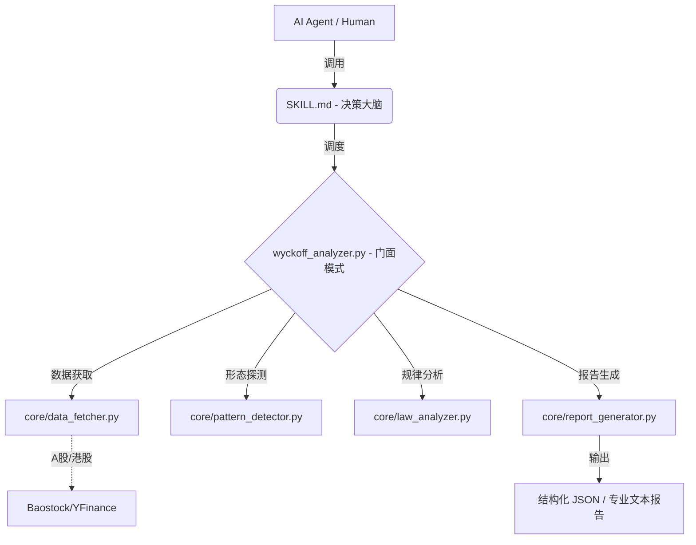

# 📈 Wyckoff Stock Analysis Skill v4.2.0

> **专业级 AI Agent 威科夫量化分析组件**  
> 专为 Claude Code, Cursor, MCP 客户端及量化交易员打造的“大脑+工具”双核引擎。

---

## 💎 为什么选择本项目？

本项目并非简单的“提示词模板”，而是一套经过生产级重构的 **Agent 技能包**。
1.  **零幻觉**：形态识别由本地 Python 向量化算法完成，模型仅负责逻辑推理。
2.  **全量化**：基于理查德·威科夫（Richard D. Wyckoff）的经典理论，将抽象概念转为精确的数学阈值。

---

## 🏗️ 核心架构：大脑与四肢



---

## 🌟 核心特性 (v4.2.0)

| 特性 | 描述 |
| :--- | :--- |
| **服务化架构** | 引入 `ScreenerService`，统一并行扫描与深度筛选入口，性能提升 200%。 |
| **原生 MCP 支持** | 内置 `mcp_server.py`，支持资源安全管理（Context Management）。 |
| **内存与性能优化** | 集成 **LRUCache (TTL)** 缓存机制，确保在大规模扫描时内存占用稳定。 |
| **回测与情绪引擎** | 独立 `BacktestEngine` 与 `SentimentAnalyzer`，提供历史胜率参考。 |
| **强类型 Pydantic v2** | 全面重构 `schemas.py`，所有输出均经过严格的嵌套模型校验。 |
| **全市场适配** | 针对 A 股一字板等极端量价形态进行了专项规则优化。 |

---

## 🚀 快速上手

### 1. 环境准备
建议在 Python 3.8 - 3.12 环境下使用虚拟环境：

```bash
# 创建并激活虚拟环境 (可选)
python -m venv venv
source venv/bin/activate  # Linux/Mac
.\venv\Scripts\activate   # Windows

# 安装依赖
pip install -r requirements.txt
```

### 2. 命令行体验
```bash
# 体验人类可读报告 (美股)
python tools/wyckoff_analyzer.py AAPL

# 体验 AI 友好 JSON 输出 (A股)
python tools/wyckoff_analyzer.py sh.600519 --json
```

### 3. MCP 接入 (AI Agent 推荐)
在 `claude_desktop_config.json` 中添加：
```json
"mcpServers": {
  "wyckoff": {
    "command": "python",
    "args": ["C:/绝对路径/tools/mcp_server.py"]
  }
}
```

---

## 📁 项目导航

```text
wyckoff-stock-analysis/
├── SKILL.md                 # [大脑] AI Agent 系统指令与路由规则
├── tools/                   # [执行] 量化工具库
│   ├── core/                #   └── 核心计算引擎：探测/回测/情绪/缓存
│   ├── services/            #   └── 外部服务接口：ScreenerService (统一筛选)
│   ├── config/              #   └── settings.py：基于 Pydantic 的阈值管理
│   ├── mcp_server.py        #   └── MCP 协议标准服务端 (支持上下文管理)
│   ├── schemas.py           #   └── 强类型数据契约 (Pydantic Models)
│   └── wyckoff_utils.py     #   └── 数据池仓库 (STOCK_POOLS)
└── tests/                   # [质量] 50+ 单元测试，覆盖全核心路径
```

---

## 🔄 版本更新

### v4.2.0 (2026-05-03) - 工业级稳健性升级
-   **整合**: 引入 `ScreenerService`，合并并行扫描与深度筛选逻辑。
-   **性能**: 集成 `LRUCache` 与 `Context Manager`，资源释放自动化。
-   **数据**: 重构全量 Pydantic Schemas，实现 100% 强类型接口。
-   **解耦**: 拆分回测与情绪分析引擎，提升 `ReportGenerator` 可维护性。

### v4.1.0 (2026-05-02) - 架构模块化重构
-   **重构**：完成单一职责原则（SRP）改造，拆解单体文件。
-   **测试**：新增 30+ 单元测试。

---

## 🤝 参与贡献

如果你对量化逻辑有改进建议、发现了 bug，或者想分享绝佳的交易案例，欢迎提交 Issue 或 Pull Request！  
**记住：交易是一场关于概率的修行，保护本金是第一优先级。** 📈

---

### 历史更新日志 (精简)

<details>
<summary>点击查看早期更新</summary>

- **v4.0.0**: 引入 MCP Server，支持 Pydantic 输出架构。
- **v3.9.0**: 全量向量化运算优化，速度提升 5-10 倍；引入内存分析缓存。
- **v3.8.0**: 接入日志设施，优化 Spring 探测窗口。
</details>

---


