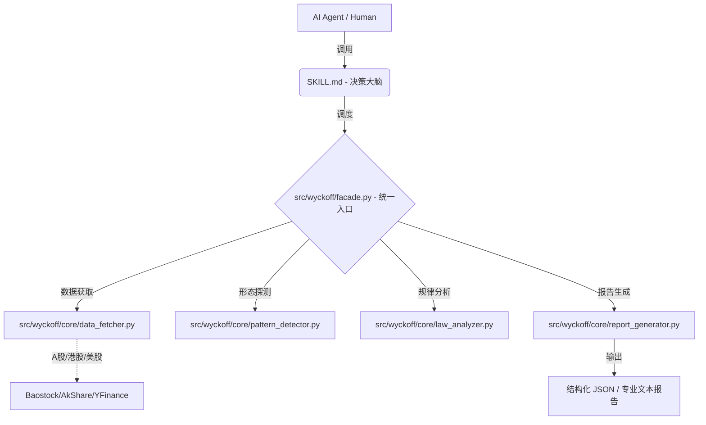

# 📈 Wyckoff Stock Analysis Skill v3.1.0 "Meng Refined Edition"

[](https://www.python.org/)
[](https://docs.pydantic.dev/)
[](LICENSE)
[](CHANGELOG.md)

> **专业级 AI Agent 威科夫量化分析组件**
> 专为 Claude Code, Cursor, MCP 客户端及量化交易员打造的"大脑+工具"双核引擎。

---

## 💎 为什么选择本项目？

本项目并非简单的"提示词模板"，而是一套经过生产级重构的 **Agent 技能包**。

1.  **🧠 零幻觉**：形态识别由本地 Python 向量化算法完成，模型仅负责逻辑推理，杜绝 AI 对图表的臆断。
2.  **📏 贝叶斯微观动力学 (WIE 3.0)**：独家引入 6x6 非对称隐马尔可夫模型 (HMM)，提供精准的 S0-S5 市场状态概率推演。
3.  **🔄 动态术语**：根据当前市场阶段（吸筹/派发）动态调整术语解释，确保分析结论在威科夫逻辑内自洽。
4.  **🛡️ 逻辑证伪**：明确列出“证伪条件”，不仅告诉你什么时候买，还告诉你什么时候你判断错了，提供纠错预案。
5.  **⚡ 纯正威科夫哲学**：系统坚持“探照灯”原则，用量化照亮背景（APS/VPOC），把定性与交易决策的权力彻底交还给人类。

---

## 🏗️ 核心架构：大脑与四肢



---

## 🚀 快速开始

### 1. 安装依赖
```bash
pip install -r requirements.txt
```

### 2. 命令行使用 (CLI)
```bash
# 分析美股（输出专业文本报告）
python -m apps.cli.main AAPL

# 分析A股（输出结构化 JSON）
python -m apps.cli.main sh.600519 --format json

# 批量扫描选股
python -m apps.cli.main --batch --symbols "AAPL,MSFT,GOOGL"
```

### 3. MCP 服务器配置 (Claude Desktop)
将以下配置添加到你的 `claude_desktop_config.json`：

```json
"mcpServers": {
  "wyckoff": {
    "command": "python",
    "args": ["/你的项目路径/apps/mcp/server.py"]
  }
}
```

---

## 🌟 v3.1.0 核心功能亮点 (Meng Refined Edition)

| 功能 | 说明 |
|------|------|
| **贝叶斯概率推演 (HMM)** | 基于 6x6 非对称转移矩阵推算 S0-S5 六大微观状态分布，符合因果定律的序列后验概率。 |
| **机构级微观背景 (APS/VPOC)** | 暴露 `microstructure_background` 节点，提供吸收分 (APS)、收敛天数 (CDS)、筹码峰 (VPOC) 等物理参量。 |
| **“探照灯”双重视角** | 形态检测与微观背景解耦。如：“检测到 Spring，但处于 S5 派发的高概率环境”，判断权归于用户。 |
| **孟洪涛精细化重构 (二期)** | 实现了 Spring 5 重硬性过滤、AR 四层立即反弹检测、LPS ATR 动态容差、JOC 强度与测试质量对齐、以及区间失效风控机制。 |
| **跨周期 EVR 共振** | 实现 Effort vs Result 的周线-日线跨级别共振分析，识别具备大级别潜力的主力吸筹行情。 |
| **高性能 SOS 向量化** | 重构 SOS 向量化识别逻辑，实现与迭代算法完美对齐，回测提速 10 倍以上。 |

---

## 📁 项目结构

```text
wyckoff-stock-analysis/
├── SKILL.md                 # [大脑] AI Agent 系统指令与路由规则
├── src/wyckoff/             # [库层] 威科夫分析核心库
│   ├── facade.py            # ⭐ 统一入口 (WyckoffAnalyzer)
│   ├── core/                # 核心引擎 (30+ 模块)
│   │   ├── pattern_detector.py   # 形态识别 (v2.0 增强)
│   │   ├── phase_coordinator.py  # 阶段协调与证伪
│   │   ├── point_and_figure.py   # 点数图计算 (因果法则)
│   │   └── adaptive/             # 贝叶斯自适应阈值系统
│   └── schemas.py           # 强类型数据契约 (Pydantic)
├── apps/                    # [应用层] CLI 与 MCP 服务器
├── tests/                   # [质量] 142 个单元测试用例 (100% 通过)
└── references/              # [理论] 威科夫理论与孟洪涛方法参考
```

---

## 📚 文档导航

*   📖 [README.md](README.md) - 项目概述
*   🧠 [SKILL.md](SKILL.md) - AI Agent 系统指令
*   📘 [HOW_TO_USE.md](HOW_TO_USE.md) - 详细使用指南
*   📜 [CHANGELOG.md](CHANGELOG.md) - 版本更新日志

---

## ⚠️ 免责声明
> 本项目仅供学习和研究使用，不构成投资建议。股市有风险，投资需谨慎。交易是一场关于概率的修行，保护本金是第一优先级。 📈
