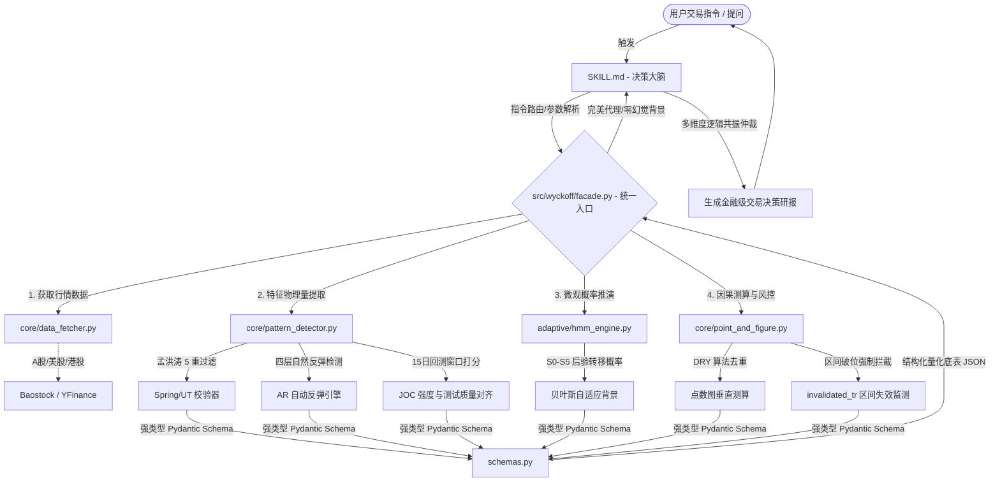

# 📈 Wyckoff Stock Analysis Skill v3.1.0 "Meng Refined Edition"

<!-- Badges Grid -->
<div align="center">


**🌌 探照灯（Searchlight）原则量化践行者 —— 专业级 AI Agent 威科夫理论深度量化分析引擎**

*专为 Claude Code, Cursor, MCP 客户端及专业交易员打造的「量化算法 + 贝叶斯大脑」双核决策包。*
</div>

---

## 💎 为什么选择本项目？（核心优势）

绝大多数“AI + 威科夫”项目都只是简陋的 Prompt 模版，导致 AI 在没有实体图表数据的情况下频繁胡言乱语。**本项目完成了「量化识别」与「大模型定性推理」的彻底解耦**。

```
                    ┌──────────────────────────────┐
                    │  Python 向量化算法 / HMM 引擎  │ ◄─── 纯物理级客观测算 (0 幻觉)
                    └──────────────┬───────────────┘
                                   │ (输出强类型 Pydantic JSON)
                                   ▼
                    ┌──────────────────────────────┐
                    │      SKILL.md (决策大脑)      │ ◄─── 孟洪涛五重过滤与风控仲裁
                    └──────────────┬───────────────┘
                                   ▼
                    ┌──────────────────────────────┐
                    │     AI Agent 深度研报生成      │ ◄─── 自洽、无幻觉的交易决策支持
                    └──────────────────────────────┘
```

1. **🧠 零幻觉底座**：形态识别、趋势边界由本地高阶向量化算法计算，AI 不再“瞎画线”，彻底杜绝图表幻觉。
2. **📏 贝叶斯微观动力学 (WIE 3.1)**：独家引入 6x6 非对称隐马尔可夫模型 (HMM)，基于因果定律为 S0-S5 市场微观状态提供概率后验推演。
3. **🛡️ 孟洪涛二期精细化重构**：
   * **Spring 5重硬性过滤**：收盘位置必须在底部 range 70% 以上才予承认，硬性拦截虚弱的伪反弹。
   * **AR 立即反弹检测**：实现“立即反弹 -> 5日扩展 -> Swing 极值 -> 15日兜底”的 4 层自适应检测架构。
   * **LPS 动态 ATR 容差**：引入 0.5~1.5x ATR 动态波动率防溢价，完美过滤高波动市场的虚假跌破。
4. **⚠️ 区间失效风控 (Invalidated TR)**：当价格实质性跌破交易区间底部且未能规定时间内拉回时，主动废除垂直测算目标，并强力警示 AI：“结构已坏，必须等待重建”，保障资金安全。
5. **🔄 动态术语自适应**：根据当前处于「吸筹」还是「派发」阶段，动态切换概念释义，从语义底层完全杜绝 LPS 与 LPSY（Last Point of Supply，空头入场点）的混淆。

---

## 🏗️ 探照灯（Searchlight）双轨决策架构

项目坚持**“用量化照亮背景，将决策权归还人类与 Agent 决策大脑”**的探照灯哲学。



---

## ⚡ 极简 API 接入（3 行代码起飞）

量化交易员或开发者可在 Python 代码中实现极致简单的集成：

```python
from src.wyckoff import WyckoffAnalyzer

# 1. 初始化分析器 (自动识别 A股/港股/美股 代码格式)
analyzer = WyckoffAnalyzer("AAPL")

# 2. 惰性加载背景数据并执行物理量推演
analyzer.fetch_data()

# 3. 获取强类型结构化数据模型，或直接输出排版极其精美的专业研报
json_data = analyzer.generate_json()  # Pydantic 强类型模型
text_report = analyzer.generate_report()  # 零幻觉专业研报
print(text_report)
```

---

## 📟 终端研报拟真输出 (Simulated Console View)

运行 `python -m apps.cli.main sh.600519` 将在终端或 AI 客户端直接展现信息浓度极高的图形化研报：

```ansi
================================================================================
📈 Wyckoff Quantitative Diagnosis Report [Meng Refined v3.1.0]
================================================================================
🎯 CORE DECISION: [ LONG PLAN ] | 🟢 Recommendation: Buy on Dips (逢低建仓)
--------------------------------------------------------------------------------
📌 KEY TRADING LEVELS:
  • Entry Zone   : 1680.00 - 1710.00 CNY
  • Stop Loss    : 1642.50 CNY (来源: Spring 底部 -1.5% 动态容差偏离)
  • Target 1     : 1890.00 CNY (来源: 垂直测算, 计算式: 1700 + 3.8 * 50)
  • Target 2     : 2050.00 CNY (来源: 潜在因果上限)
  • Invalid Level: 1650.00 CNY (注意: 若实质性收盘跌破此位，结构失效)

📊 WYCKOFF STRUCTURAL MATRIX:
  • Current Phase: Phase C (吸筹末期 - 终极测试进行中) [置信度: 89%]
  • Key Events   : Spring (Type 3 Safe) [确认] | JOC (强测试通过) [确认]
  • Invalidation : invalidated_tr = False (交易区间结构运行完好)
  • AR Detection : Natural AR (SC后立即反弹确认, 幅度 12.4%)

🧠 MICROSTRUCTURE & BAYESIAN HMM:
  • Absorption Score (APS) : 12.4 (筹码呈高度中性偏吸收状态)
  • Dominant HMM State     : S3 - Accumulation Markup Ready [后验概率: 74.2%]
  • Effort vs Result       : 🟢 Normal (缩量回踩, 供应明显枯竭)
  • JOC Test Quality       : Score 8.5/10 (回测缩量, 突破有效性极高)

⚠️ MENG'S RETRIEVAL FILTERING CHECK:
  [PASS] Spring close_position = 0.78 (符合 >= 0.70 高位收盘过滤，供应已被降服)
  [PASS] LPS ATR dynamic margin = 1.2 * ATR (动态通道未发生物理异常波动)
================================================================================
```

---

## 📁 规范的项目结构

```text
wyckoff-stock-analysis/
├── SKILL.md                 # 🧠 [决策大脑] AI Agent 系统级提示词与路由策略 (v3.1.0)
├── HOW_TO_USE.md            # 📘 [使用指南] 多平台、MCP 服务器挂载与风控说明书
├── src/wyckoff/             # 🛠️ [核心库层] 威科夫量化与贝叶斯推演引擎
│   ├── facade.py            # ⭐ 统一入口 (WyckoffAnalyzer)
│   ├── schemas.py           # 强类型数据契约与接口约束 (Pydantic Models)
│   ├── core/                # 核心量化引擎目录
│   │   ├── pattern_detector.py   # 形态、AR四层、LPS与Spring过滤
│   │   ├── point_and_figure.py   # 点数图测算引擎（DRY 与 区间失效检测）
│   │   └── data_fetcher.py       # A股/港股/美股 数据自动适配工厂
│   └── adaptive/            # 贝叶斯自适应环境推演
│       └── hmm_engine.py         # 6x6 非对称隐马尔可夫微观概率状态机
├── apps/                    # 🚀 [应用层]
│   ├── cli/                 # 命令行终端分析应用
│   └── mcp/                 # 原生 MCP (Model Context Protocol) 协议服务器
├── tests/                   # 🧪 [质量保证] 142 个专业级单元测试用例 (100% 通过)
└── references/              # 📚 [理论底座] 孟洪涛《新威科夫操盘法》及相关文献
```

---

## 🔮 演进路线 (Roadmap)

- [x] **v1.0 - v2.0**: 实现传统形态识别与因果点数图测算。
- [x] **v3.0**: 引入贝叶斯 HMM 自适应微观概率推演，解耦形态与背景（探照灯视角）。
- [x] **v3.1 (Meng Refined 二期)**: 精细化重构 Spring 5 重过滤、AR 4 层反弹、LPS ATR 动态容差、区间失效风控、以及双计算轨算法 100% 对齐。
- [ ] **v3.2 (计划中)**: 接入实时 Level-2 订单簿数据流，以微秒级大单吃货特征（Order Book Imbalance）自适应修正 HMM 转移矩阵。
- [ ] **v4.0 (长期规划)**: 实现基于强化学习 (RL) 的自动执行逻辑代理，将威科夫形态信号直接映射为动态仓位风控策略。

---

## ⚠️ 免责声明

> 本项目仅供学习和学术研究使用，不构成任何投资建议。股市有风险，投资需谨慎。**交易是一场关于概率与自我约束的修行，保护本金是生存的绝对第一优先级。** 📈
