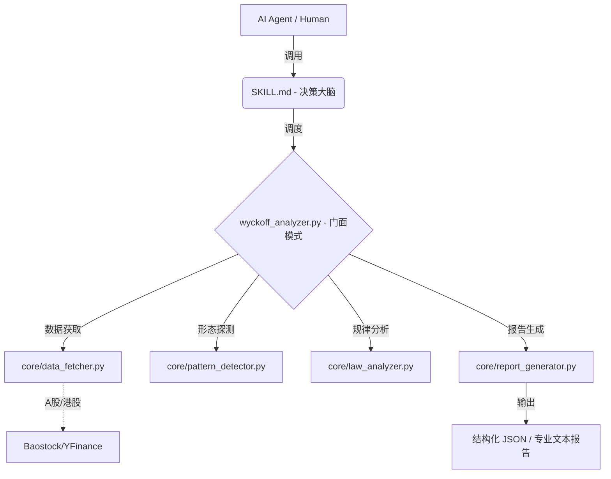

# 📈 Wyckoff Stock Analysis Skill v4.1.0

> **专业级 AI Agent 威科夫量化分析组件**  
> 专为 Claude Code, Cursor, MCP 客户端及量化交易员打造的“大脑+工具”双核引擎。

---

## 💎 为什么选择本项目？

本项目并非简单的“提示词模板”，而是一套经过生产级重构的 **Agent 技能包**。
1.  **零幻觉**：形态识别由本地 Python 向量化算法完成，模型仅负责逻辑推理。
2.  **全量化**：基于理查德·威科夫（Richard D. Wyckoff）的经典理论，将抽象概念转为精确的数学阈值。

---

## 🏗️ 核心架构：大脑与四肢



---

## 🌟 核心特性

| 特性 | 描述 |
| :--- | :--- |
| **双核驱动** | **SKILL.md** 充当大脑路由，**tools/** 充当执行四肢，实现 AI 与量化的完美结合。 |
| **原生 MCP 支持** | 内置 `mcp_server.py`，支持 Claude Desktop、Cursor 等工具一键接入。 |
| **单一职责架构** | v4.1.0 彻底解耦，四大模块（数据/探测/分析/报告）独立运作，易于扩展。 |
| **严格数据校验** | 基于 **Pydantic** 的配置与输出校验，确保数据流 100% 符合 Schema。 |
| **工程级测试** | 覆盖率高的单元测试（30+ 用例），确保核心探测算法的稳健性。 |
| **全市场适配** | 针对 A 股一字板等极端量价形态进行了专项规则优化。 |

---

## 🚀 快速上手

### 1. 环境准备
建议在 Python 3.8 - 3.12 环境下使用虚拟环境：

```bash
# 创建并激活虚拟环境 (可选)
python -m venv venv
source venv/bin/activate  # Linux/Mac
.\venv\Scripts\activate   # Windows

# 安装依赖
pip install -r requirements.txt
```

### 2. 命令行体验
```bash
# 体验人类可读报告 (美股)
python tools/wyckoff_analyzer.py AAPL

# 体验 AI 友好 JSON 输出 (A股)
python tools/wyckoff_analyzer.py sh.600519 --json
```

### 3. MCP 接入 (AI Agent 推荐)
在 `claude_desktop_config.json` 中添加：
```json
"mcpServers": {
  "wyckoff": {
    "command": "python",
    "args": ["C:/绝对路径/tools/mcp_server.py"]
  }
}
```

---

## 📁 项目导航

```text
wyckoff-stock-analysis/
├── SKILL.md                 # [大脑] AI Agent 系统指令与路由规则
├── .env.example             # [配置] 环境变量模板（可自定义分析阈值）
├── tests/                   # [质量] 覆盖形态、配置、数据预处理的单元测试
│   ├── test_config.py
│   ├── test_data_fetcher.py
│   └── test_pattern_detector.py
├── tools/                   # [执行] 量化工具库
│   ├── core/                #   └── 核心模块：数据/探测/分析/报告
│   ├── config/              #   └── settings.py：基于 Pydantic 的阈值管理
│   ├── mcp_server.py        #   └── MCP 协议标准服务端
│   └── wyckoff_utils.py     #   └── 批量选股器 (WyckoffScreener)
└── references/              # [理论] 威科夫理论深度知识库与实战案例
```

---

## 🔄 版本更新

### v4.1.0 (2026-05-02) - 架构跨越式升级
-   **重构**：完成单一职责原则（SRP）改造，将单体文件拆解为 4 个独立核心模块。
-   **测试**：新增 31 个单元测试，覆盖率大幅提升。
-   **功能**：补全 `LawAnalyzer` 中的初步支撑/阻力及吸筹/耗散模式分析逻辑。
-   **规范**：统一版本管理，完善 `.env.example` 与依赖版本上限。

---

## 🤝 参与贡献

如果你对量化逻辑有改进建议、发现了 bug，或者想分享绝佳的交易案例，欢迎提交 Issue 或 Pull Request！  
**记住：交易是一场关于概率的修行，保护本金是第一优先级。** 📈

---

### 历史更新日志 (精简)

<details>
<summary>点击查看早期更新</summary>

- **v4.0.0**: 引入 MCP Server，支持 Pydantic 输出架构。
- **v3.9.0**: 全量向量化运算优化，速度提升 5-10 倍；引入内存分析缓存。
- **v3.8.0**: 接入日志设施，优化 Spring 探测窗口。
</details>

---


