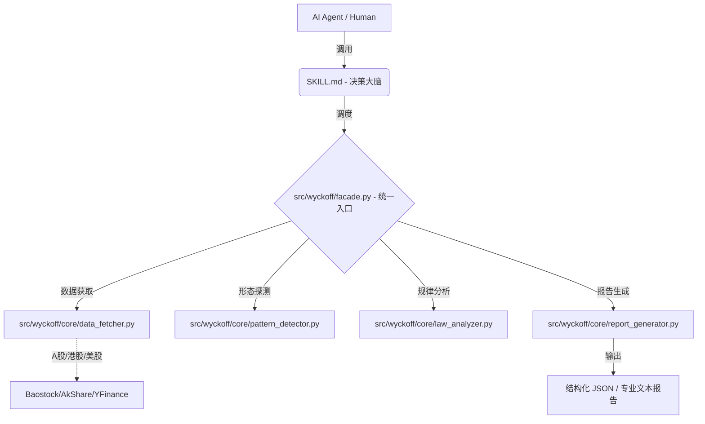

# 📈 Wyckoff Stock Analysis Skill v2.6.0 "Expert Edition"

[](https://www.python.org/)
[](https://docs.pydantic.dev/)
[](LICENSE)
[](CHANGELOG.md)

> **专业级 AI Agent 威科夫量化分析组件**
> 专为 Claude Code, Cursor, MCP 客户端及量化交易员打造的"大脑+工具"双核引擎。

---

## 💎 为什么选择本项目？

本项目并非简单的"提示词模板"，而是一套经过生产级重构的 **Agent 技能包**。

1.  **🧠 零幻觉**：形态识别由本地 Python 向量化算法完成，模型仅负责逻辑推理，杜绝 AI 对图表的臆断。
2.  **📏 全量化**：基于理查德·威科夫（Richard D. Wyckoff）经典理论，将抽象概念（如“供应衰竭”）转为精确的数学阈值。
3.  **🔄 动态术语**：根据当前市场阶段（吸筹/派发）动态调整术语解释，确保分析结论在威科夫逻辑内自洽。
4.  **🛡️ 逻辑证伪**：明确列出“证伪条件”，不仅告诉你什么时候买，还告诉你什么时候你判断错了，提供纠错预案。
5.  **⚡ 贝叶斯自适应**：内置贝叶斯阈值模型，自动根据不同标的的波动率（ATR）调整识别灵敏度。

---

## 🏗️ 核心架构：大脑与四肢



---

## 🚀 快速开始

### 1. 安装依赖
```bash
pip install -r requirements.txt
```

### 2. 命令行使用 (CLI)
```bash
# 分析美股（输出专业文本报告）
python -m apps.cli.main AAPL

# 分析A股（输出结构化 JSON）
python -m apps.cli.main sh.600519 --format json

# 批量扫描选股
python -m apps.cli.main --batch --symbols "AAPL,MSFT,GOOGL"
```

### 3. MCP 服务器配置 (Claude Desktop)
将以下配置添加到你的 `claude_desktop_config.json`：

```json
"mcpServers": {
  "wyckoff": {
    "command": "python",
    "args": ["/你的项目路径/apps/mcp/server.py"]
  }
}
```

---

## 🌟 v2.0.0 核心功能亮点

| 功能 | 说明 |
|------|------|
| **孟洪涛增强检测** | 完美实现《新威科夫操盘法》中的 Spring 5 重过滤及 JOC 强度分类。 |
| **多周期共振** | 自动分析日线、周线、月线趋势的一致性，捕捉高胜率共振信号。 |
| **点数图 (P&F)** | 基于横盘时间计算“因果法则”目标位，量化上涨/下跌空间。 |
| **供需评估** | 量化每一波反弹与回撤中的供需比，识别主力吸筹质量。 |
| **信号生命周期** | 自动管理信号时效性，通过 10 日窗口验证 Spring/JOC 的真伪并自动更新信号状态。 |
| **PS/PSY 早期预警** | 检测 Phase A 的“初步”进场/抛压信号 (PS/PSY)，建立从趋势停止到高潮确认的完整证据链。 |
| **跨周期 EVR 共振** | 实现 Effort vs Result 的周线-日线跨级别共振分析，识别具备大级别潜力的主力吸筹行情。 |

---

## 📁 项目结构

```text
wyckoff-stock-analysis/
├── SKILL.md                 # [大脑] AI Agent 系统指令与路由规则
├── src/wyckoff/             # [库层] 威科夫分析核心库
│   ├── facade.py            # ⭐ 统一入口 (WyckoffAnalyzer)
│   ├── core/                # 核心引擎 (30+ 模块)
│   │   ├── pattern_detector.py   # 形态识别 (v2.0 增强)
│   │   ├── phase_coordinator.py  # 阶段协调与证伪
│   │   ├── point_and_figure.py   # 点数图计算 (因果法则)
│   │   └── adaptive/             # 贝叶斯自适应阈值系统
│   └── schemas.py           # 强类型数据契约 (Pydantic)
├── apps/                    # [应用层] CLI 与 MCP 服务器
├── tests/                   # [质量] 92+ 单元测试用例
└── references/              # [理论] 威科夫理论与孟洪涛方法参考
```

---

## 📚 文档导航

*   📖 [README.md](README.md) - 项目概述
*   🧠 [SKILL.md](SKILL.md) - AI Agent 系统指令
*   📘 [HOW_TO_USE.md](HOW_TO_USE.md) - 详细使用指南
*   📜 [CHANGELOG.md](CHANGELOG.md) - 版本更新日志

---

## ⚠️ 免责声明
> 本项目仅供学习和研究使用，不构成投资建议。股市有风险，投资需谨慎。交易是一场关于概率的修行，保护本金是第一优先级。 📈
