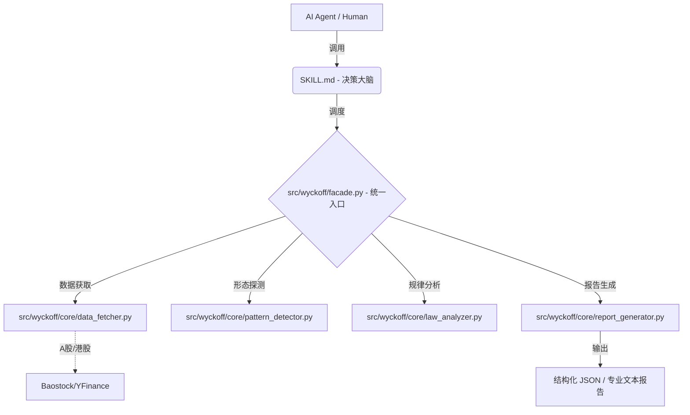

# 📈 Wyckoff Stock Analysis Skill v1.0.0

> **专业级 AI Agent 威科夫量化分析组件**  
> 专为 Claude Code, Cursor, MCP 客户端及量化交易员打造的"大脑+工具"双核引擎。

---

## 💎 为什么选择本项目？

本项目并非简单的"提示词模板"，而是一套经过生产级重构的 **Agent 技能包**。
1.  **零幻觉**：形态识别由本地 Python 向量化算法完成，模型仅负责逻辑推理。
2.  **全量化**：基于理查德·威科夫（Richard D. Wyckoff）的经典理论，将抽象概念转为精确的数学阈值。
3.  **动态术语**：根据当前市场阶段（吸筹/派发）动态调整术语解释，确保分析结论一致。
4.  **逻辑证伪**：明确列出"什么情况下你判断错了"，提供可执行、可纠错的交易系统预案。

---

## 🏗️ 核心架构：大脑与四肢



---

## 🌟 核心特性 (v1.0.0)

| 特性 | 描述 |
| :--- | :--- |
| **威科夫阶段识别** | 自动识别吸筹/派发阶段（Phase A-E），支持多时间框架共振分析 |
| **事件检测约束** | 当 phase == Distribution 时，所有向上突破尝试一律归为 upthrust，不生成 sos |
| **动态术语表** | 根据当前阶段动态调整术语解释，避免"术语表与正文互相拆台" |
| **逻辑证伪点** | 明确列出派发逻辑的证伪条件，提供可执行、可纠错的交易系统预案 |
| **时间维度分析** | 引入结构持续时间评估，增强结论可靠性 |
| **因果法则优化** | 基于点数图水平计数，未跌破支撑前不展示下跌目标 |
| **原生 MCP 支持** | 内置 `apps/mcp/server.py`，支持资源安全管理 |
| **强类型 Pydantic v2** | 全面重构 `schemas.py`，所有输出均经过严格的嵌套模型校验 |
| **全市场适配** | 针对 A 股一字板等极端量价形态进行了专项规则优化 |

---

## 🚀 快速上手

### 1. 环境准备
建议在 Python 3.8 - 3.12 环境下使用虚拟环境：

```bash
# 创建并激活虚拟环境 (可选)
python -m venv venv
source venv/bin/activate  # Linux/Mac
.\venv\Scripts\activate   # Windows

# 安装依赖
pip install -r requirements.txt
```

### 2. 命令行体验
```bash
# 体验人类可读报告 (美股)
python -m apps.cli.main AAPL

# 体验 AI 友好 JSON 输出 (A股)
python -m apps.cli.main sh.600519 --format json

# 批量扫描多只股票
python -m apps.cli.main --batch --symbols "AAPL,MSFT,GOOGL"
```

### 3. MCP 接入 (AI Agent 推荐)
在 `claude_desktop_config.json` 中添加（需将 `%PROJECT_ROOT%` 替换为实际项目路径）：
```json
"mcpServers": {
  "wyckoff": {
    "command": "python",
    "args": ["%PROJECT_ROOT%/apps/mcp/server.py"]
  }
}
```
**获取实际路径**：
```bash
# Linux/Mac
pwd  # 输出项目完整路径

# Windows
cd   # 输出项目完整路径
```

---

## 📁 项目导航（核心路径版）

> **⚠️ 注意**：以下为简化导航，仅展示核心文件和目录。

```text
wyckoff-stock-analysis/
├── SKILL.md                 # [大脑] AI Agent 系统指令与路由规则
├── README.md                # [文档] 项目说明（本文件）
├── src/                     # [库层] 纯库代码，可被任何应用导入
│   └── wyckoff/             #   └── 威科夫分析核心库
│       ├── facade.py        #       ⭐ WyckoffAnalyzer 统一入口
│       ├── core/            #       └── 核心计算引擎（25+ 模块）
│       │   ├── pattern_detector.py    # 形态识别
│       │   ├── law_analyzer.py        # 威科夫定律分析
│       │   ├── data_fetcher.py        # 数据获取
│       │   ├── report_generator.py    # 报告生成
│       │   ├── point_and_figure.py    # 点数图（因果法则）
│       │   ├── orchestrator.py        # 编排器
│       │   └── ...                    # 其他核心模块
│       ├── services/        #       └── 外部服务接口
│       │   └── screener_service.py    # ⭐ 批量扫描服务
│       ├── config/          #       └── 配置管理
│       │   └── settings.py            # Pydantic 阈值配置
│       ├── schemas.py       #       ⭐ 强类型数据契约
│       ├── exceptions.py    #       └── 异常定义
│       └── error_codes.py   #       └── 错误码定义
├── apps/                    # [应用层] 应用程序入口
│   ├── cli/                 #   └── 命令行工具
│   │   └── main.py          #       ⭐ CLI 入口
│   └── mcp/                 #   └── MCP 服务器
│       └── server.py        #       ⭐ MCP 服务器
├── tests/                   # [质量] 单元测试（90+ 测试用例）
│   ├── test_*.py            #   14 个测试文件
│   └── conftest.py          #   pytest 配置
├── references/              # [文档] 理论文档和实战指南
│   ├── wyckoff-theory-full.md    # 完整理论
│   ├── meng-hongtao-wyckoff-method.md  # 孟洪涛方法
│   └── ...                         # 其他参考文档
└── scripts/                 # [工具] 开发和维护脚本
    └── check_repo_claims.py      # ⭐ README 校验脚本
```

**架构原则：**
- 库层 (`src/wyckoff/`) 不反向依赖应用层 (`apps/`)
- 应用层仅调用库层的公共 API
- ⭐ 标记为常用或重要文件

---

## 🤝 参与贡献

如果你对量化逻辑有改进建议、发现了 bug，或者想分享绝佳的交易案例，欢迎提交 Issue 或 Pull Request！  
**记住：交易是一场关于概率的修行，保护本金是第一优先级。** 📈

---
