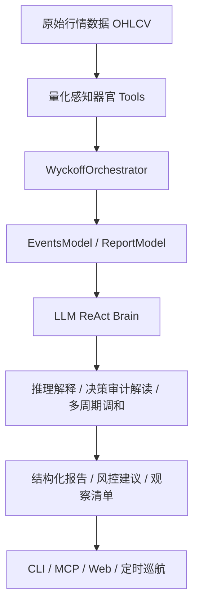

# Wyckoff Agent Execution Plan

## 目标

在当前 `wyckoff-stock-analysis` 项目基础上，开发一个“威科夫分析与交易风控智能体”。

该智能体不直接下单，主要负责：

- 单股威科夫分析
- 持仓诊断
- 多标的比较
- 股票池扫描
- 信号解释
- 观察清单监控
- 风险提示与交易计划生成

核心原则：智能体只编排工具和解释结果，不重新发明威科夫检测算法。所有信号事实必须来自现有分析引擎输出。

## 架构总纲：双脑协同系统

智能体采用“量化硬骨骼 + LLM 软大脑”的双脑协同架构。



### 量化硬骨骼

负责确定性分析：

- K 线与成交量数据清洗。
- 威科夫阶段识别。
- Spring / JOC / SOS / LPS / LPSY / SOW 检测。
- P&F 因果测算。
- WIE 微观结构识别。
- `strategy_decision_audit` 风控审计。
- `TradingPlanModel` 与 `RiskAdviceModel` 生成。

量化层输出强类型契约数据：

```text
EventsModel
ReportModel
TradingPlanModel
RiskAdviceModel
StrategyDecisionAuditModel
```

### LLM 软大脑

负责非确定性编排与解释：

- 识别用户意图。
- 自动选择工具。
- 解释决策审计日志。
- 调和日线、周线、月线冲突。
- 总结 RS、市场环境和微观结构背景。
- 生成用户容易理解的投研式报告。
- 对风险建议进行自然语言展开。

LLM 不允许直接创造技术信号。凡是涉及交易结构的判断，必须回到量化工具输出。

## 核心应用场景

### 场景一：全自动市场巡航与机会发掘 Agent

可行性：高。适合作为第一批落地功能。

工作流：

1. Agent 定时或通过命令触发股票池扫描。
2. 调用批量扫描器获取候选股票。
3. 对每个标的调用 `WyckoffOrchestrator` 生成 `ReportModel`。
4. 读取 `strategy_decision_audit`。
5. 筛选高质量机会：
   - `signal_quality.score >= 80`
   - 无 `watch_only`
   - 无 `blocked`
   - 非 `transition_period`
   - 有 JOC + LPS 或明确高质量突破结构
6. 生成投研日报。

输出示例：

```text
今日扫描到 3 个高质量威科夫结构：
1. XXXX：JOC 后缩量 LPS，RS 强于大盘，审计日志无风控拦截。
2. YYYY：Spring 已确认，等待 JOC。
3. ZZZZ：突破质量高，但尚未回测，列入观察。
```

### 场景二：交互式威科夫私人投顾

可行性：高。适合作为 MVP 核心体验。

工作流：

1. 用户自然语言提问。
2. Agent 自动识别标的、持仓、风险偏好。
3. 调用 `orchestrator.run_analysis(symbol)`。
4. 读取 `EventsModel`、`trading_plan`、`risk_advice`。
5. 用通俗但专业的语言回答。

示例：

```text
用户：这只股票跌了这么多，我现在能抄底吗？

Agent：不建议接飞刀。系统显示当前不是 Spring，而是旧结构失效后的过渡期；
LPS 未确认，交易计划为观望，仓位建议 0%。如果后续重新形成 TR 并出现 JOC+LPS，
才进入低风险观察区。
```

## 技术选型

### Agent 框架

MVP 阶段：

- 先使用项目内轻量 Agent 编排。
- IntentRouter 用规则实现。
- ResponseComposer 使用模板 + 字段映射。

增强阶段：

- 可接入 LangChain 或 LlamaIndex。
- 如果需要多智能体协同，可考虑 Microsoft AutoGen。

### 协议对齐

优先支持 MCP：

- 将 `WyckoffOrchestrator`、P&F 测算、股票池扫描、持仓诊断包装成 MCP 工具。
- MCP 层只做参数转发，不做业务判断。

### 记忆引擎

短期记忆：

- 当前会话上下文。
- 最近一次分析结果。
- 用户观察清单。
- 当前持仓输入。

长期记忆：

- 历史 `strategy_decision_audit`。
- 历史分析结果。
- 阈值调优记录。

初版使用 JSON / SQLite，后续再考虑 Vector DB。

## 三阶段路线图

| 阶段 | 任务目标 | 核心输出 |
| --- | --- | --- |
| PHASE 1 | 工具原子化包装 | 将 `run_analysis`、P&F 测算、扫描器包装成标准 Python functions，并提供详细 docstrings |
| PHASE 2 | ReAct 决策环开发 | 支持自然语言输入，自动选择工具，解释 `strategy_decision_audit` |
| PHASE 3 | 报告图表智能生成 | 生成投研式报告，并为后续 Streamlit / React 看板提供结构化数据 |

## 定位

### 应做

- 分析标的所处威科夫阶段。
- 解释 Spring、JOC、SOS、LPS、LPSY、SOW 等事件。
- 输出交易计划、风险建议、观察条件。
- 对用户持仓进行风控诊断。
- 对股票池进行候选结构筛选。
- 为观察清单生成状态变化提醒。

### 不应做

- 不自动下单。
- 不保证收益。
- 不在低信号质量时鼓励重仓。
- 不绕过 `events_detected` 自行推断另一套信号。
- 不在数据缺失时编造分析结论。

## 总体架构

```text
User / CLI / MCP / Web
        |
        v
WyckoffAgent
        |
        +-- IntentRouter
        +-- ToolRegistry
        +-- AnalysisExecutor
        +-- ResponseComposer
        +-- RiskGuard
        +-- AgentMemory / Watchlist
        |
        v
Existing Wyckoff Engine
        |
        +-- WyckoffAnalyzer
        +-- DataFetcher
        +-- PhaseCoordinator
        +-- SignalExtractor
        +-- TradingPlanGenerator
        +-- RecommendationEngine
```

## 目录规划

新增目录：

```text
src/wyckoff/agent/
├── __init__.py
├── agent.py
├── intent_router.py
├── tools.py
├── response_composer.py
├── risk_guard.py
├── memory.py
├── contracts.py
└── exceptions.py

apps/agent/
├── __init__.py
└── main.py

tests/agent/
├── __init__.py
├── test_intent_router.py
├── test_agent_tools.py
├── test_response_composer.py
├── test_risk_guard.py
└── test_agent_cli.py
```

后续可选目录：

```text
data/watchlists/
├── default.json
└── user_watchlist.json
```

## MVP 能力

### 1. 单股分析

用户输入：

```text
分析 隆基绿能
分析 sh.601012
```

智能体动作：

1. 解析标的。
2. 调用现有分析引擎。
3. 读取标准 JSON。
4. 输出阶段、TR、事件、信号质量、交易计划、风险建议。

验收：

- 能识别中文名称和股票代码。
- 数据失败时明确报错，不生成虚假结论。
- 输出不超过核心字段范围。

### 2. 持仓诊断

用户输入：

```text
我 15.8 买了隆基绿能，仓位30%，现在怎么办
```

智能体动作：

1. 解析 symbol、成本价、仓位。
2. 调用分析引擎。
3. 结合 `trading_plan`、`risk_advice`、`signal_quality`。
4. 输出持仓状态、风险等级、减仓/持有/观望建议。

验收：

- 低信号质量时不得建议加仓。
- `transition_period` 时强制提示“等待新区间确认”。
- 输出明确止损参考或说明无有效止损。

### 3. 多标的比较

用户输入：

```text
比较 英维克 隆基绿能 科创50ETF
```

智能体动作：

1. 批量解析标的。
2. 逐个调用分析。
3. 按信号质量、阶段、交易计划、风险状态排序。
4. 输出可观察优先级。

验收：

- 单个标的数据失败不影响其他标的。
- 比较结果必须给出排序依据。
- 不把 `观望` 标的包装成买点。

### 4. 信号解释

用户输入：

```text
为什么这个不是 LPS？
为什么科创50ETF不能追？
```

智能体动作：

1. 读取最近一次分析上下文。
2. 检查缺失条件。
3. 输出原因。

常见解释项：

- 无 JOC。
- 无 SOS。
- 无 LPS。
- TR 已失效。
- 处于 `transition_period`。
- 信号质量低。
- 多周期不共振。
- 微观结构冲突。

验收：

- 必须引用具体字段，例如 `patterns.lps.detected=false`。
- 不允许泛泛解释。

### 5. 股票池扫描

用户输入：

```text
扫描 A 股里接近 LPS 的票
扫描我的观察池
```

智能体动作：

1. 读取股票池。
2. 批量调用分析。
3. 筛选候选结构。
4. 输出 Top N。

初版筛选条件：

- `signal_quality.score >= 50`
- 非 `transition_period`
- 有 JOC/SOS 或接近 LPS
- 风险建议不是全观望

验收：

- 支持限制扫描数量。
- 支持跳过失败标的。
- 输出包含失败摘要。

### 6. 观察清单

用户输入：

```text
帮我盯着科创50ETF有没有 LPS
```

智能体动作：

1. 写入观察清单。
2. 记录 symbol、条件、风险偏好。
3. 后续定时任务调用分析。
4. 条件触发时输出提醒。

初版只实现本地 JSON，不实现推送。

验收：

- 可添加、查看、删除观察项。
- 条件触发逻辑可测试。

## 标准工具接口

### analyze_symbol

```python
def analyze_symbol(symbol: str, *, period: str = "1y") -> dict:
    """返回现有威科夫分析 JSON。"""
```

要求：

- 内部调用 `WyckoffAnalyzer` 或 CLI 等价库接口。
- 输出必须保持现有 JSON 结构。
- 捕获数据源错误并返回结构化错误。

### diagnose_position

```python
def diagnose_position(
    symbol: str,
    cost_price: float,
    position_pct: float,
    *,
    risk_profile: str = "moderate",
) -> dict:
    """返回持仓诊断。"""
```

输出字段：

```text
symbol
current_price
cost_price
unrealized_return_pct
risk_level
action
reason
stop_reference
position_advice
source_analysis
```

### compare_symbols

```python
def compare_symbols(symbols: list[str]) -> dict:
    """批量分析并排序。"""
```

输出字段：

```text
ranked
failed
summary
```

### explain_signal

```python
def explain_signal(symbol: str, signal_type: str, analysis: dict | None = None) -> dict:
    """解释某个信号是否成立。"""
```

### scan_pool

```python
def scan_pool(pool_name: str, *, limit: int = 50, criteria: str = "lps_candidate") -> dict:
    """扫描股票池。"""
```

### watchlist_update

```python
def watchlist_update(action: str, item: dict | None = None) -> dict:
    """维护观察清单。"""
```

## IntentRouter 设计

初版使用规则路由，不引入外部 LLM。

### 意图类型

```text
analyze_symbol
diagnose_position
compare_symbols
explain_signal
scan_pool
watchlist_add
watchlist_list
watchlist_remove
help
unknown
```

### 简单规则

- 包含“分析” + 标的：`analyze_symbol`
- 包含“买了 / 成本 / 仓位 / 怎么办”：`diagnose_position`
- 包含“比较”：`compare_symbols`
- 包含“为什么”：`explain_signal`
- 包含“扫描”：`scan_pool`
- 包含“盯着 / 监控 / 提醒”：`watchlist_add`

## ResponseComposer 设计

输出使用中文 Markdown，默认结构：

```text
核心结论
结构状态
关键价位
信号解释
操作建议
风险提示
```

单股分析必须包含：

- 当前价格
- 威科夫阶段
- TR 高低位
- Spring/JOC/SOS/LPS 状态
- signal_quality
- trading_plan.direction
- position_sizing

持仓诊断必须包含：

- 成本价
- 当前价
- 浮盈浮亏
- 持仓风险等级
- 动作建议

## RiskGuard 规则

智能体输出前必须经过 `RiskGuard`。

### 强制观望条件

满足任一条件，禁止输出买入/加仓建议：

- `trading_range.transition_period == true`
- `trading_range.invalidated_tr == true`
- `signal_quality.score < 50`
- `trading_plan.direction == "观望"`
- `patterns.lps.detected == false` 且用户询问标准 LPS 买点
- 多周期提示无共振且 signal_quality 低

### 仓位限制

- 低信号质量：0%
- 中等信号质量：最多 20%-30%，且必须有止损
- 高信号质量：仍需根据风险偏好限制仓位

### 文案限制

禁止输出：

- “一定上涨”
- “稳赚”
- “满仓”
- “无风险”

必须输出：

- “仅供分析，不构成投资建议”

## 开发步骤

### Step 1：Agent 契约与工具层

新增：

- `src/wyckoff/agent/contracts.py`
- `src/wyckoff/agent/tools.py`
- `tests/agent/test_agent_tools.py`

任务：

1. 定义工具输入输出 TypedDict 或 Pydantic Model。
2. 实现 `analyze_symbol()`。
3. 实现错误封装。

验收命令：

```powershell
python -m pytest tests/agent/test_agent_tools.py -q
```

### Step 2：IntentRouter

新增：

- `src/wyckoff/agent/intent_router.py`
- `tests/agent/test_intent_router.py`

任务：

1. 实现中文规则路由。
2. 支持股票代码、中文名、ETF 简称。
3. 支持解析成本价和仓位。

验收：

```powershell
python -m pytest tests/agent/test_intent_router.py -q
```

### Step 3：ResponseComposer

新增：

- `src/wyckoff/agent/response_composer.py`
- `tests/agent/test_response_composer.py`

任务：

1. 单股报告生成。
2. 持仓诊断报告生成。
3. 多标的比较报告生成。

验收：

```powershell
python -m pytest tests/agent/test_response_composer.py -q
```

### Step 4：RiskGuard

新增：

- `src/wyckoff/agent/risk_guard.py`
- `tests/agent/test_risk_guard.py`

任务：

1. 实现强制观望规则。
2. 实现仓位限制。
3. 实现禁用文案检查。

验收：

```powershell
python -m pytest tests/agent/test_risk_guard.py -q
```

### Step 5：Agent 主类

新增：

- `src/wyckoff/agent/agent.py`

任务：

1. 组合 router、tools、composer、risk_guard。
2. 暴露 `run(user_input: str) -> str`。
3. 保存最近一次分析上下文，供追问使用。

验收：

```powershell
python -m pytest tests/agent -q
```

### Step 6：CLI Agent

新增：

- `apps/agent/__init__.py`
- `apps/agent/main.py`

命令：

```powershell
python -m apps.agent.main "分析 隆基绿能"
python -m apps.agent.main "我 15.8 买了隆基绿能，仓位30%，现在怎么办"
python -m apps.agent.main "比较 英维克 隆基绿能 科创50ETF"
```

验收：

```powershell
python -m apps.agent.main "分析 sh.601012"
```

### Step 7：观察清单

新增：

- `src/wyckoff/agent/memory.py`
- `data/watchlists/default.json`

任务：

1. 添加观察项。
2. 查看观察项。
3. 删除观察项。
4. 评估观察条件。

验收：

```powershell
python -m apps.agent.main "帮我盯着 科创50ETF 有没有 LPS"
python -m apps.agent.main "查看观察清单"
```

## MCP 集成方案

现有项目已有 MCP server，可后续增加 agent 工具。

建议新增工具：

```text
agent_analyze
agent_diagnose_position
agent_compare
agent_explain_signal
agent_scan_pool
agent_watchlist
```

MCP 层只做参数转发，不写业务逻辑。

## 测试矩阵

### 单元测试

- 意图识别
- 参数解析
- 风险守卫
- 报告生成
- 工具错误处理

### 集成测试

- 单股分析 CLI
- 持仓诊断 CLI
- 多标的比较 CLI
- 观察清单增删查

### 回归测试

必须继续通过：

```powershell
python -m pytest tests/core tests/iterations -q
```

### 全量测试

```powershell
python -m pytest -q
```

## MVP 完成定义

MVP 完成时应满足：

1. `python -m apps.agent.main "分析 sh.601012"` 可输出完整威科夫智能体报告。
2. `python -m apps.agent.main "我 15.8 买了隆基绿能，仓位30%，怎么办"` 可输出持仓诊断。
3. `python -m apps.agent.main "比较 英维克 隆基绿能 科创50ETF"` 可输出排序比较。
4. `RiskGuard` 能阻止低质量信号下的买入/加仓建议。
5. Agent 不直接调用底层 detector 生成第二套信号，只读取现有分析 JSON。
6. 全量测试通过。

## 推荐提交拆分

1. `agent-contracts-tools`
   - contracts
   - tools
   - analyze_symbol

2. `agent-router-composer`
   - intent router
   - response composer

3. `agent-risk-guard`
   - risk guard
   - safety tests

4. `agent-cli`
   - apps.agent.main
   - CLI integration tests

5. `agent-watchlist`
   - memory
   - watchlist JSON
   - watchlist tests

## 后续增强

### LLM 编排

MVP 先不用 LLM。后续如果接入 LLM，只允许 LLM 做：

- 意图理解
- 自然语言组织
- 追问澄清

不允许 LLM 自行判定技术信号。

### Web UI

可基于 FastAPI + 前端做：

- 单股分析页
- 持仓诊断页
- 股票池扫描页
- 观察清单页

### 定时监控

可增加 automation / cron：

- 每日收盘后扫描观察池
- 只在状态变化时输出提醒
- 记录上一次信号状态，避免重复提醒

## 风险与缓解

### 数据源不稳定

缓解：

- 使用缓存。
- AkShare 失败回退 BaoStock。
- 错误结构化返回。

### 扫描性能慢

缓解：

- 限制默认扫描数量。
- 缓存最近分析结果。
- 先粗筛后精算。

### 交易建议过度激进

缓解：

- RiskGuard 强制观望规则。
- 信号质量与仓位绑定。
- 默认输出“观察条件”，而不是直接买卖指令。

### 双轨不一致

缓解：

- Agent 只读 `WyckoffAnalyzer` 输出。
- 不直接调用 detector。
- 新增 agent 级一致性测试。
